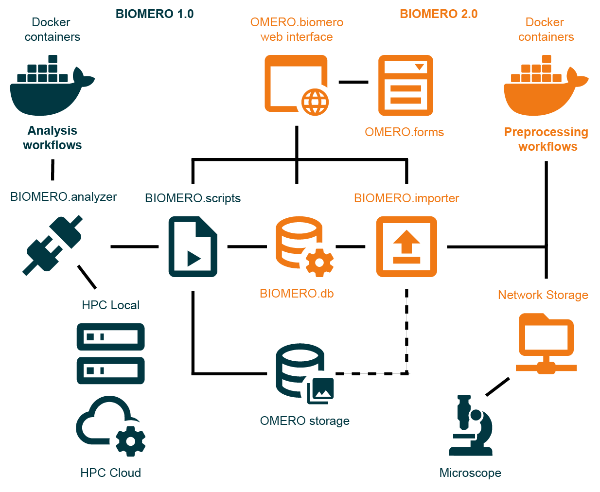

# Containerized OMERO with BIOMERO

NL‑BIOMERO delivers a full containerized stack to run **OMERO** together with the **BIOMERO 2.0** framework. It provides Docker/Podman configurations and Compose files to deploy OMERO + BIOMERO subsystems (importer, analyzer, OMERO.web plugin, databases, and auxiliary services) — the recommended starting point for a FAIR‑oriented bioimaging setup.

BIOMERO 2.0 is described in our preprint: [“BIOMERO 2.0: end-to-end FAIR infrastructure for bioimaging data import, analysis, and provenance”](https://arxiv.org/abs/2511.13611). It transforms OMERO into a provenance‑aware, FAIR (findable, accessible, interoperable, reusable) platform by combining:
- containerized data import and preprocessing (importer subsystem),  
- containerized or HPC‑based analysis workflows (analyzer subsystem),  
- metadata enrichment, versioning, and provenance tracking,  
- integrated workflow monitoring and dashboards.

🎥 **Introduction video**  
👉 https://nl-bioimaging.github.io/NL-BIOMERO/overview.html

Using NL‑BIOMERO yields a unified environment where image data import, preprocessing, analysis, and provenance tracking are managed end-to-end — from raw data to processed results — in a reproducible, shareable, FAIR‑compliant infrastructure.

## Architecture Overview



*BIOMERO 2.0 architecture showing the integration of containerized analysis workflows (BIOMERO 1.0), preprocessing workflows (BIOMERO 2.0), and the unified OMERO.biomero web interface with OMERO.forms for metadata collection.*

It uses Docker Compose to setup an OMERO grid on one computer with a server, web, processor, and a BIOMERO processor, importer and database.
If you want to experiment with a local HPC cluster, an example Docker Compose setup is hosted <a href="https://github.com/NL-BioImaging/NL-BIOMERO-Local-Slurm" target="_blank" rel="noopener noreferrer">here</a>.

This is an adaptation of OME's <a href="https://github.com/ome/docker-example-omero-grid" target="_blank" rel="noopener noreferrer">OMERO.server grid and OMERO.web (docker-compose)</a> / <a href="http://www.openmicroscopy.org/site/support/omero5/sysadmins/grid.html#nodes-on-multiple-hosts" target="_blank" rel="noopener noreferrer">OMERO.server components on multiple nodes using OMERO.grid</a>.

- OMERO.server listens on ports `4063` and `4064`  
- OMERO.web listens on port `4080` (http://localhost:4080/)  

> ⚠️ **Warning:** This setup is mainly intended for demonstration or development purposes. For professional deployments, refer to the documented deployment scenarios in our documentation and see the [deployment scenarios](./deployment_scenarios) folder. We **strongly discourage** running Slurm inside Docker Compose for production; connect BIOMERO to a real HPC cluster to ensure stability, full feature support, and performance.

---

## 🚀 Platform-Specific Deployment

### Windows (Docker Desktop)
Follow the **Quickstart** section below for Windows deployment with Docker Desktop.

### Ubuntu/Linux
For Ubuntu/Linux deployments (with SSL support), see our dedicated guide:
📖 **[Ubuntu/Linux Deployment Guide](README.linux.md)**

---

## Quickstart (Windows)

**Note**: This quickstart is based on Windows Docker Desktop and uses `host.docker.internal` to communicate between local clusters. Linux users should refer to the [Ubuntu/Linux guide](README.linux.md).

### 0. Prerequisites

- Docker Desktop
- Git for Windows
- a SSH keypair (@ ~/.ssh/id_rsa)
- Powershell

Then do all these steps in Powershell:

### 1. Clone and Setup
Clone this repository locally:

```bash
git clone --recursive https://github.com/NL-BioImaging/NL-BIOMERO.git
cd NL-BIOMERO
```

### 2. Configure Environment
First, customize your environment file `.env`:

```bash
# Edit .env with your secure passwords and configuration
# Edit biomeroworker/slurm-config.ini if you need different BIOMERO settings
# Toggle UI components (both default to TRUE):
# IMPORTER_ENABLED=TRUE   # Enables the BIOMERO.importer UI module
# ANALYZER_ENABLED=TRUE   # Enables the BIOMERO.analyzer UI module
# Set either to FALSE to hide that module from OMERO.web without removing containers
```

### 3. Setup Slurm Connection (Optional)
For local testing with a containerized Slurm cluster:

```bash
# Setup local Slurm cluster
cd ..
git clone https://github.com/NL-BioImaging/NL-BIOMERO-Local-Slurm
cd NL-BIOMERO-Local-Slurm
cp ~/.ssh/id_rsa.pub .
docker compose -f .\docker-compose-from-dockerhub.yml up -d --build  
cd ../NL-BIOMERO
```

### 4. Configure SSH Access
Test Slurm connectivity:

```bash
# from your host machine:
ssh -i ~/.ssh/id_rsa -p 2222 -o StrictHostKeyChecking=no slurm@localhost
# or from inside your biomeroworker container:
ssh -i ~/.ssh/id_rsa -p 2222 -o StrictHostKeyChecking=no slurm@host.docker.internal
exit
```

If successful, create an SSH alias:

```bash
cp ssh.config.example ~/.ssh/config
```

If not successful, try forcing ownership and permissions (and then try ssh again):

```bash
# from your host machine:
docker exec -it slurmctld bash -c "chown -R slurm:slurm /home/slurm/.ssh && chmod 700 /home/slurm/.ssh && chmod 600 /home/slurm/.ssh/authorized_keys" 
```

### 5. Deploy NL-BIOMERO
Launch the full stack:

```bash
# For development (with local builds)
docker-compose build --no-cache
# Then run in the background
docker-compose up -d

# OR 

# For production (using pre-built images)
docker-compose --env-file .\.env -f .\deployment_scenarios\docker-compose-from-dockerhub.yml pull
# wait ~10 min for download
docker-compose --env-file .\.env -f .\deployment_scenarios\docker-compose-from-dockerhub.yml up -d
```

Monitor the deployment:

```bash
docker-compose logs -f

# OR

docker-compose --env-file .\.env -f .\deployment_scenarios\docker-compose-from-dockerhub.yml logs -f
```
Exit w/ CTRL + C

Verify the alias works:

```bash
# go inside your biomeroworker container:
docker-compose exec biomeroworker bash
# OR
docker-compose --env-file .\.env -f .\deployment_scenarios\docker-compose-from-dockerhub.yml exec biomeroworker bash 

# from inside your biomeroworker container:
ssh localslurm
exit
exit
```

### 6. Access the Interfaces
- **OMERO.web**: http://localhost:4080
  - **Login**: `root` / `omero` (change default password)
- **Metabase**: http://localhost:3000  
  - **Login**: `admin@biomero.com` / `b1omero` (change default password)

If you disabled modules via `IMPORTER_ENABLED=FALSE` or `ANALYZER_ENABLED=FALSE`, the corresponding UI tabs/panels won't appear.


---

## 📊 Data Import

To get started with data:

1. **Web Import**: Use the Importer tab in OMERO.biomero at http://localhost:4080/omero_biomero/biomero/
2. **OMERO.insight**: Download the <a href="https://downloads.openmicroscopy.org/help/pdfs/getting-started-5.pdf" target="_blank" rel="noopener noreferrer">desktop client</a>
   - Connect to `localhost:4063`
   - Login as `root` / `omero`

---

## 🧬 BIOMERO - BioImage Analysis

Checkout the <a href="https://nl-bioimaging.github.io/biomero/" target="_blank" rel="noopener noreferrer">BIOMERO documentation</a> for detailed usage instructions.

### Quick Workflow Example:

1. **Initialize Environment**:
   - Run script: `biomero` > `admin` > `SLURM Init environment...`
   - ☕ Grab coffee (10+ min download time for a few workflow containers)

2. **Run Analysis**:
   - Select your image/dataset
   - Run script: `biomero` > `__workflows` >`SLURM Run Workflow...`
   - Configure import: Change `Import into NEW Dataset` → `hello_world`
   - Select workflow: e.g., `cellpose`
   - Set parameters: nucleus channel, GPU settings, etc.

OR

2. **OMERO.biomero Analyzer UI**:
   - Use the Analyzer tab at http://localhost:4080/omero_biomero/biomero/?tab=biomero
   - Select your workflow: e.g., `Cellpose`
   - Add Dataset, select the image(s) you want to segment
   - Fill in the workflow parameters in tab 2, e.g. nuclei channel 3
   - Select desired output target, e.g. Select Dataset `hello_world` again (don't forget to press ENTER if you're typing it); and Run!
   - Track your workflow status at the `Status` tab


3. **View Results**:
   - Refresh OMERO `Explore` tab (in the Data tab; http://localhost:4080/webclient/)
   - Find your `hello_world` dataset with generated masks

---

## 🛠️ Container Management

### Basic Operations
```bash
# Stop the cluster
docker-compose down

# Remove with volumes (⚠️ deletes data)
docker-compose down --volumes

# Rebuild single container
docker-compose up -d --build --force-recreate <container-name>

# Access container shell
docker-compose exec <container-name> bash
```

### Useful Container Names
- `omeroserver` - OMERO server
- `omeroweb` - Web interface  
- `biomeroworker` - BIOMERO processor
- `metabase` - Analytics dashboard

---

## 🔧 Configuration

### Slurm Connection Requirements
See <a href="https://nl-bioimaging.github.io/biomero/" target="_blank" rel="noopener noreferrer">BIOMERO documentation</a> for comprehensive setup details.

**Essential Components**:
- **SSH Configuration**: Headless SSH to Slurm server
  - Server IP/hostname
  - SSH port (usually `22`)
  - Username and SSH keys
  - Alias configuration in `~/.ssh/config`
- **Slurm Configuration**: Edit `biomeroworker/slurm-config.ini`
  - SSH alias (e.g., `localslurm`)
  - Storage paths: `slurm_data_path`, `slurm_images_path`, `slurm_script_path`

### Linux Considerations
- SSH permissions: `chmod -R 777 ~/.ssh` before deployment
- Use `postgres:16-alpine` for better compatibility
- See [Ubuntu/Linux guide](README.linux.md) for detailed instructions

---

## 🎨 Frontend Customizations
This deployment includes several UI enhancements:

- **🧩 OMERO.biomero Plugin**: Unified BIOMERO.importer and BIOMERO.analyzer tabs
- **📝 OMERO.forms**: Create custom metadata forms for users to fill in
- **🔘 Better Buttons**: Improved some button design and accessibility
- **🎭 Pretty Login**: Minor enhanced login page aesthetics


The previous codename "CANVAS" has been replaced by the official name OMERO.biomero.


### Custom Institution Branding

By default, BIOMERO 2.0 uses NL-BioImaging branding. To customize:

**Change banner logo:** Mount your logo over the banner image
```yml
- "./your-logo.png:/opt/omero/web/venv3/lib/python3.12/site-packages/omeroweb/webclient/static/webclient/image/login_page_images/nl-bioimaging-banner.png:ro"
```

**Change footer logo:** Mount your logo over the footer image  
```yml
- "./your-logo.png:/opt/omero/web/venv3/lib/python3.12/site-packages/omeroweb/webclient/static/webclient/image/login_page_images/NL-BIoImaging-logo.jpg:ro"
```

**Change footer text/colors/design:** Create custom `login.html` template with inline CSS and mount it
```yml
- "./custom-login.html:/opt/omero/web/venv3/lib/python3.12/site-packages/omeroweb/webclient/templates/webclient/login.html:ro"
```

Restart container after changes: `docker-compose down omeroweb && docker-compose up -d omeroweb`

See `web/local_omeroweb_edits/pretty_login/login-amsterdamumc.html` for complete template example.

More details in [web/README.md](web/README.md).

---

## 📚 Additional Resources

- 📖 **[Ubuntu/Linux Deployment](README.linux.md)** - Production deployment guide
- 🧬 **<a href="https://nl-bioimaging.github.io/biomero/" target="_blank" rel="noopener noreferrer">BIOMERO Documentation</a>** - Analysis workflows
- 🏗️ **<a href="https://github.com/NL-BioImaging/NL-BIOMERO-Local-Slurm" target="_blank" rel="noopener noreferrer">Local Slurm Cluster</a>** - Testing environment
- 🔬 **<a href="https://omero.readthedocs.io/" target="_blank" rel="noopener noreferrer">OMERO Documentation</a>** - Core platform docs

---

## 🤝 Support

- **Issues**: <a href="https://github.com/NL-BioImaging/NL-BIOMERO/issues" target="_blank" rel="noopener noreferrer">GitHub Issues</a>
- **Discussions**: <a href="https://forum.image.sc/" target="_blank" rel="noopener noreferrer">image.sc</a> (tag #biomero)
- **Contact**: cellularimaging /at/ amsterdamumc.nl

Happy imaging! 🔬✨
